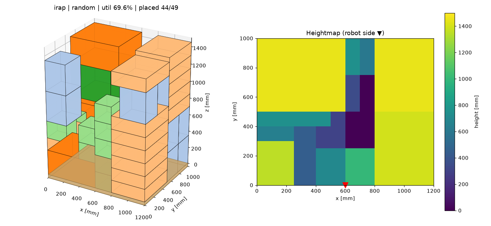
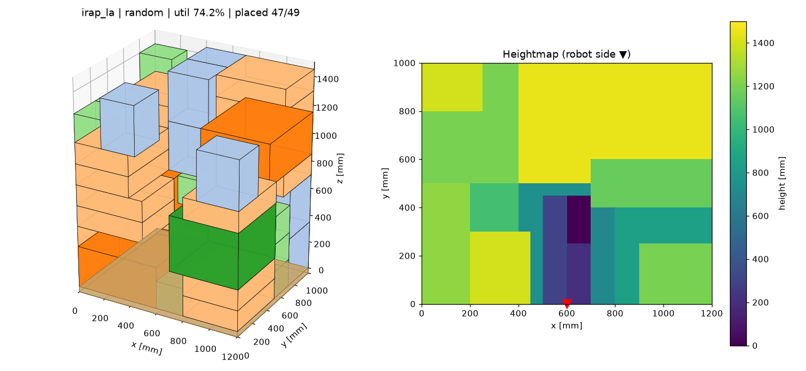

# PAC 2026 · HD현대로보틱스 과제 1 (팀 LYL)

불확정 투입 순서에 대응하는 Mixed Palletizing 적재 패턴 생성.

- 알고리즘 설계: [docs/ALGORITHM.md](docs/ALGORITHM.md)
- 구현 스택: Python, ROS2 (코어는 ROS 비의존 라이브러리)

## 구조

```
src/
└── palletizing_core/          # ROS 비의존 플래너 코어 (ament_python 패키지로도 빌드 가능)
    ├── palletizing_core/
    │   ├── config.py          # 팔레트·로봇·제약·가중치 설정 (YAML 로드)
    │   ├── model.py           # BoxType, Box, PalletState (높이맵, 지지 그래프, Extreme Point)
    │   ├── candidates.py      # M2 후보 생성 (EP × 자세 × 앵커)
    │   ├── constraints.py     # M3 하드 제약 H1~H8 (마스크)
    │   ├── scoring.py         # M4 즉시 점수 Q_now (8개 특징)
    │   ├── planner.py         # 탐욕 플래너: irap / dbl / hm
    │   ├── lookahead.py       # M6·M7 재고 기반 시나리오 롤아웃 + Successive Halving (irap_la)
    │   ├── generator.py       # 박스셋·투입 순서 생성기
    │   ├── simulate.py        # 에피소드 실행, 지표, 독립 검증기
    │   ├── viz.py             # 3D 적재 + 높이맵 시각화
    │   ├── demo.py            # 단일 에피소드 실행
    │   └── benchmark.py       # 전략 × 순서 × 시드 비교
    ├── config/default.yaml
    └── test/
```

## 실행

```bash
pip install numpy matplotlib pyyaml pytest
cd src/palletizing_core

python3 -m pytest -q test                                    # 테스트
python3 -m palletizing_core.demo --order random --seed 0     # out/demo/pallet.png, result.json
python3 -m palletizing_core.demo --strategy irap_la          # 3단계 미래 평가 플래너
python3 -m palletizing_core.benchmark --seeds 10 --jobs 4    # 전략 비교표 + out/benchmark.csv
```

주요 옵션: `--types`(박스 종류 수), `--fill`(전체 박스 부피 / 팔레트 부피), `--order {random,small_first,large_first,clustered}`, `--strategy {irap,dbl,hm,irap_la}`, `--max-rollouts`(결정당 롤아웃 수, 기본 32) 또는 `--time-budget`(결정당 초), `--lookahead-k`(상류에서 미리 본 박스 수), `--config config/default.yaml`.

## 현재 성능 (박스 종류 6개, 총부피 = 팔레트의 80%, 순서별 시드 6개)

| 투입 순서 | DBL | IRAP 탐욕 (1단계) | IRAP + 미래 평가 (3단계) |
|---|---|---|---|
| random | 58.7% | 66.1% | **69.8%** |
| small_first (불리한 순서) | 44.6% | 48.9% | **49.4%** |
| large_first | 66.0% | 67.6% | **71.8%** |
| clustered | 54.7% | 58.8% | **62.0%** |

- 수치는 팔레트 부피 대비 적재율(상한 80%)이며, 모든 실행에서 제약 위반 0건입니다.
- 3단계는 결정당 롤아웃 32회, 결정 시간은 약 0.4초입니다(4개 작업 병렬 실행 기준).
- 재현: `python3 -m palletizing_core.benchmark --seeds 6 --strategies irap dbl irap_la --jobs 4`

| 1단계 IRAP 탐욕 (69.6%) | 3단계 미래 평가 (74.2%) |
|---|---|
|  |  |

## 진행 현황

- [x] 1단계: 데이터 모델, 후보 생성, 하드 제약 마스크, 즉시 점수, 탐욕 적재, 시각화, 테스트
- [ ] 2단계: 벤치마크 확장 (실제 물류 데이터셋, 지표 보강)
- [x] 3단계: 재고 기반 시나리오 롤아웃 + Successive Halving
- [ ] 4~5단계: PPO 사전학습, Expert Iteration
- [ ] 6~7단계: ROS2 래핑, MoveIt2 검증, 예외 처리, PyBullet 안정성 검증
